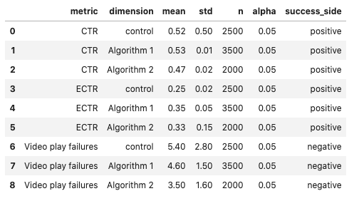
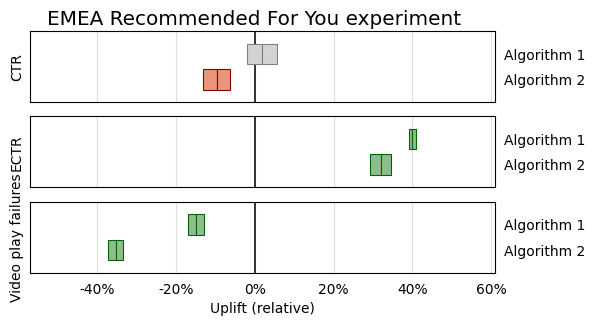
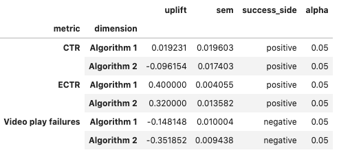

# Experiment Plots
Useful functions for analyzing and plotting experimental results

## Installation
```
!pip3 install git+https://github.com/eddykimdata/expplot
```

## Setup
```
from expplot import expplot
```

## Plotting Experiment Confidence Intervals
Adapted from https://geoffruddock.com/matplotlib-experiment-visualizations/

See the tutorial notebook in tutorial.ipynb.

```
expplot.plot_lift(
    df,
    title=None, 
    combine_axes=False,
    lift_type='relative',
    as_percent=True):

Parameters
----------
df : pd.DataFrame
    Should be in the following format (with the given column names):

    | metric   | dimension   |   mean |   std |    n |   alpha | success_side   |
    |:---------|:------------|-------:|------:|-----:|--------:|:---------------|
    | CTR      | control     |   0.52 |  0.05 | 2500 |    0.05 | positive       |
    | CTR      | A1          |   0.53 |  0.1  | 3500 |    0.05 | positive       |
    | CTR      | A2          |   0.47 |  0.2  | 2000 |    0.05 | positive       |
    | ECTR     | control     |   0.25 |  0.02 | 4000 |    0.05 | negative       |
    | ECTR     | A1          |   0.35 |  0.05 | 2000 |    0.05 | negative       |
    | ECTR     | A2          |   0.33 |  0.15 | 4000 |    0.05 | negative       |

    The columns "success_side" and 'alpha' areoptional.  If not given, the 
    columns will be created with the default success_side value as 'positive'
    and default alpha as 0.05.

title : str
    Plot title displayed at the top of the plot

combine_axes : boolean
    Only relevant for multiple-variant experiments.  If false, will plot each
    metric in its own outlined plot.  

lift_type : str
    Value must be in ['relative', 'absolute'].  Determines whether to return
    the absolute lift (mu_test - mu_control) or relative lift (mu_test - 
    mu_control) / mu_control.  

as_percent : boolean
    If true, the x-axis will be displayed as percents.

Returns
-------
fig : matplotlib.pyplot.fig

ax : matplotlib.pyplot.ax
```
Produces experiment results confidence intervals images.

Dataframe should be in the following format:



Note: columns "alpha" and "success_side" are optional.  If not provided the default will be alpha=0.05, and success_side='positive'.

```
fig, ax = expplot.plot_lift(
    df, 
    title='EMEA Recommended For You experiment',
    combine_axes=False,
    lift_type='relative', 
    as_percent=True)
```



## Getting experiment lift raw values

This function is called to provide the values for the plots in plot_lift.  Input is a dataframe with control and exp metric mu, sigma, and n, and returns the uplift (relative or absolute) and the standard
error of the lift. 

```
    Parameters
    ----------
    df : pd.DataFrame
        Should be in the following format (with the given column names):

        | metric   | dimension   |   mean |   std |    n |   alpha | success_side   |
        |:---------|:------------|-------:|------:|-----:|--------:|:---------------|
        | CTR      | control     |   0.52 |  0.05 | 2500 |    0.05 | positive       |
        | CTR      | A1          |   0.53 |  0.1  | 3500 |    0.05 | positive       |
        | CTR      | A2          |   0.47 |  0.2  | 2000 |    0.05 | positive       |
        | ECTR     | control     |   0.25 |  0.02 | 4000 |    0.05 | negative       |
        | ECTR     | A1          |   0.35 |  0.05 | 2000 |    0.05 | negative       |
        | ECTR     | A2          |   0.33 |  0.15 | 4000 |    0.05 | negative       |

        The columns "success_side" and 'alpha' areoptional.  If not given, the 
        columns will be created with the default success_side value as 'positive'
        and default alpha as 0.05.

    lift_type : str
        Value must be in ['relative', 'absolute'].  Determines whether to return
        the absolute lift (mu_test - mu_control) or relative lift (mu_test - 
        mu_control) / mu_control.  

    Returns
    -------
    df : pd.DataFrame.
        Dataframe with uplift and sem.

        |                |   uplift |        sem | success_side   |
        |:---------------|---------:|-----------:|:---------------|
        | ('CTR', 'A1')  |     0.01 | 0.00196396 | positive       |
        | ('CTR', 'A2')  |    -0.05 | 0.00458258 | positive       |
        | ('ECTR', 'A1') |     0.1  | 0.0011619  | negative       |
        | ('ECTR', 'A2') |     0.08 | 0.0023927  | negative       |
    """


```
df_lift = expplot.calculate_lift(
    df, 
    lift_type='relative')
```


